# Employee Leave Request

## Requirements
 - .NET 8 SDK 
 - IDE (Used JetBrains: Rider)
 - SQL Server Management Studio 

## Clone the Project 
 ```
 git clone https://github.com/Merve-1/Employee_Leave_Request.git
 cd EmployeeHR
 ```

## Database 
### Packages
```
dotnet add package Microsoft.EntityFrameworkCore.SqlServer
dotnet add package Microsoft.EntityFrameworkCore.Design
dotnet tool install --global dotnet-ef
```
### Configuration 
The application uses SQL Server 
Add this configuration in you appsettings.Development.json 

```
{ 
    "ConnectionStrings": { 
        "LeaveDatabase": "Server=localhost;Database=LeaveRequestsDb;Trusted_Connection=True;TrustServerCertificate=True;" 
    } 
}
```
### EFCore Migration (Create/ Update LeaveRequestsDb)
```
dotnet ef database update
```
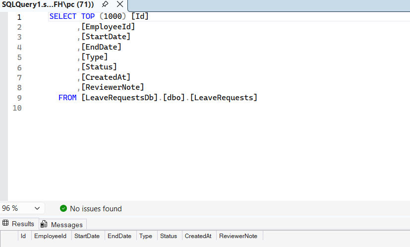
### DB After Seeding
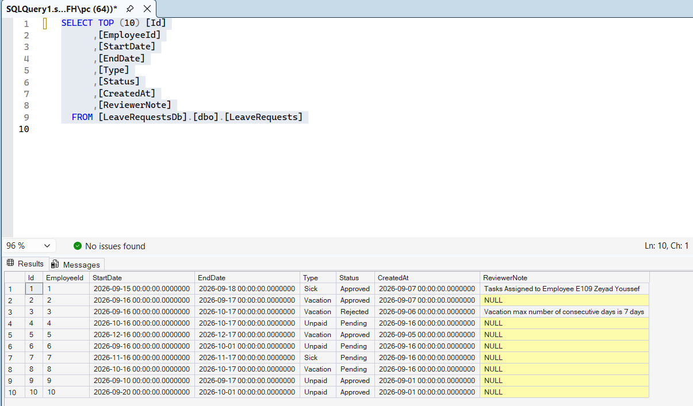

## DB using Script 
You can also create the db schema and seed the initial leave requests using the database/SQLQuery2.sql and will get the same output just change the name of the db in the appsettings.Development.json to the same db name in the script 
```
{ 
     "ConnectionStrings": { 
        "LeaveDatabase": "Server=localhost;Database=leaveRequestScript;Trusted_Connection=True;TrustServerCertificate=True;" 
    } 
}
```
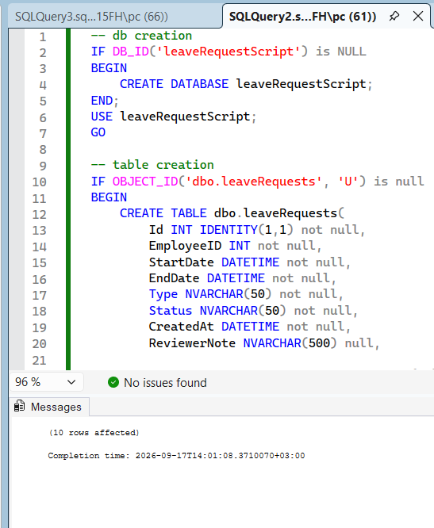
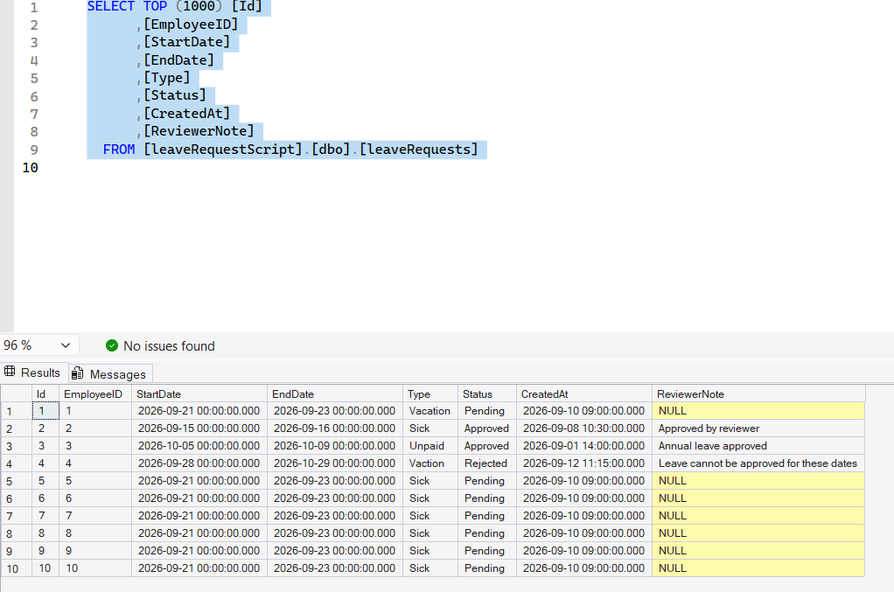
## End Points 

### Get Employees
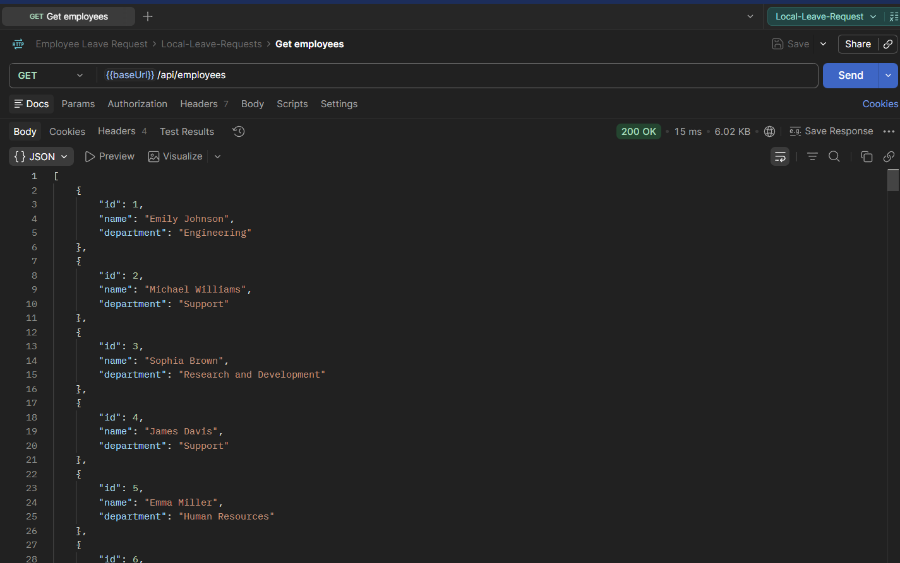
### Employee Search
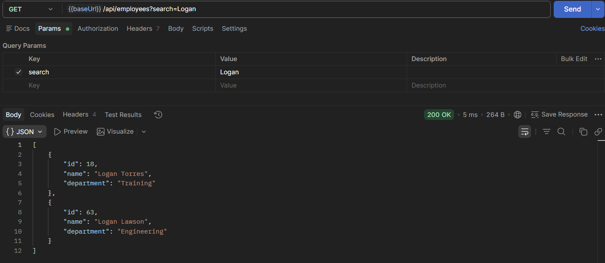
### Get All Leave Requests
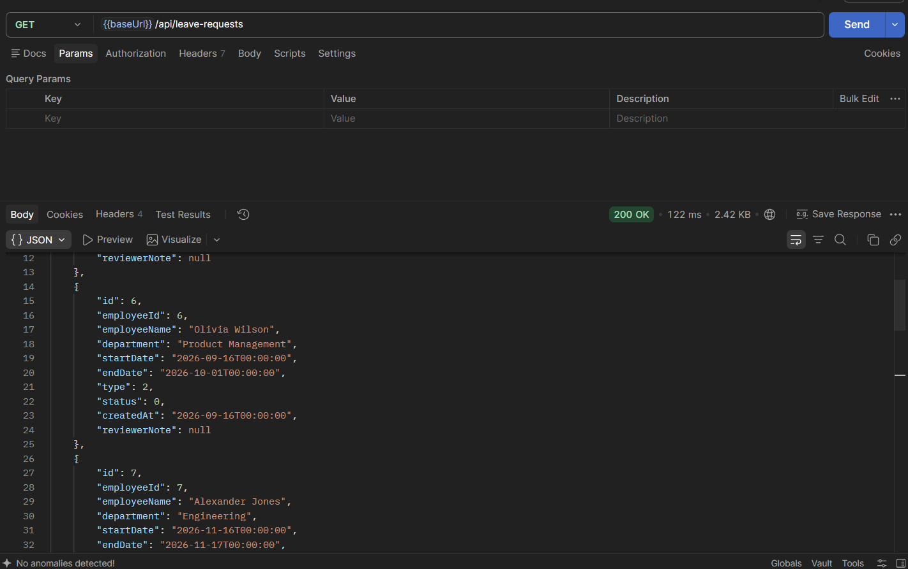
### Get Leave Request with Filter 
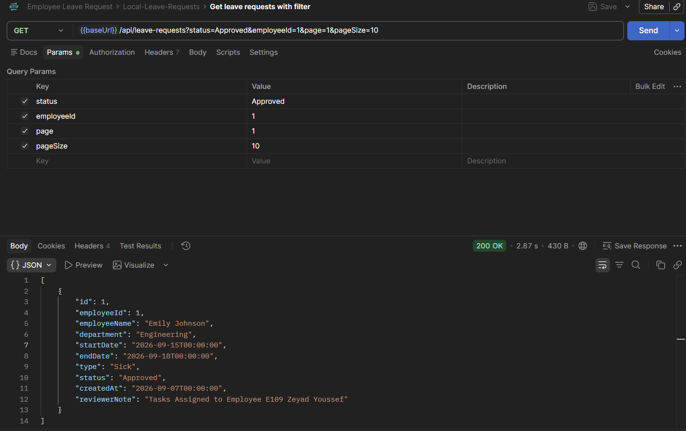
### Get Leave Request by ID
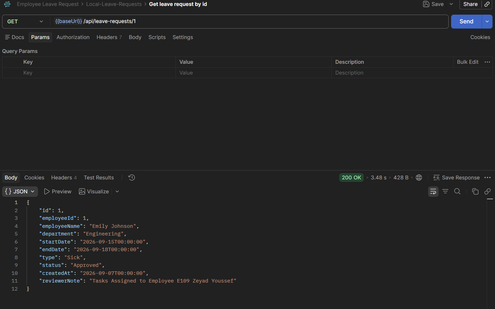
### Create Leave Request 
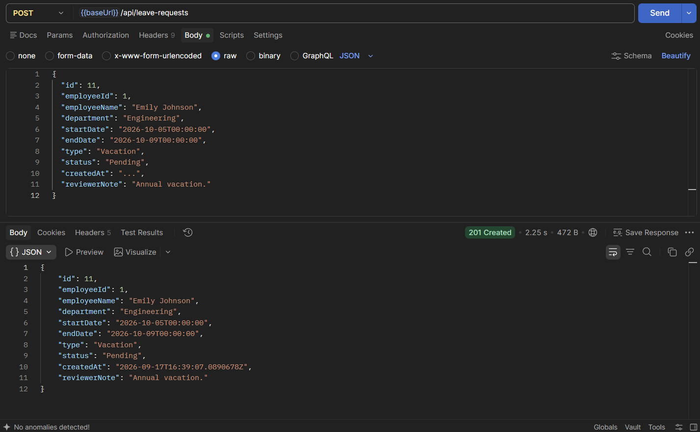
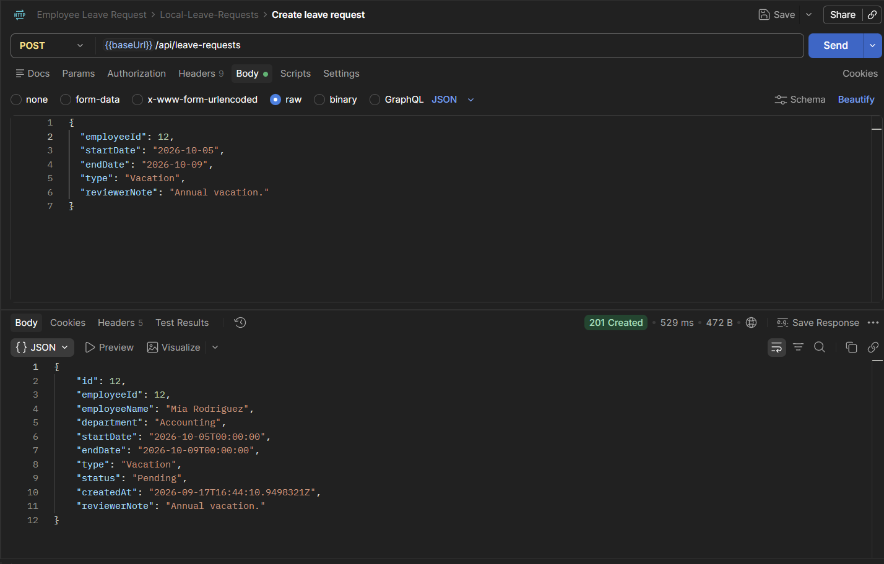
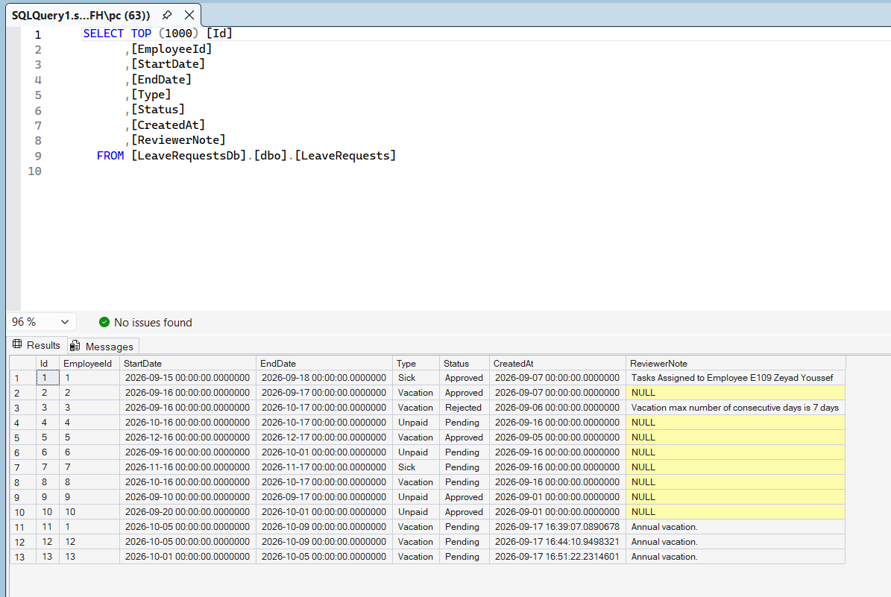
### Update Pending status 
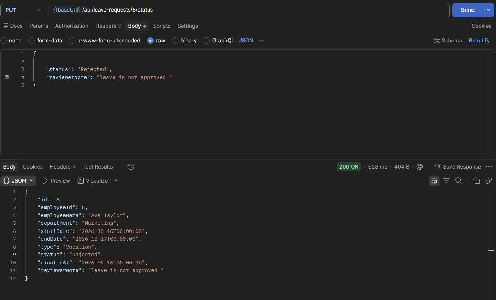
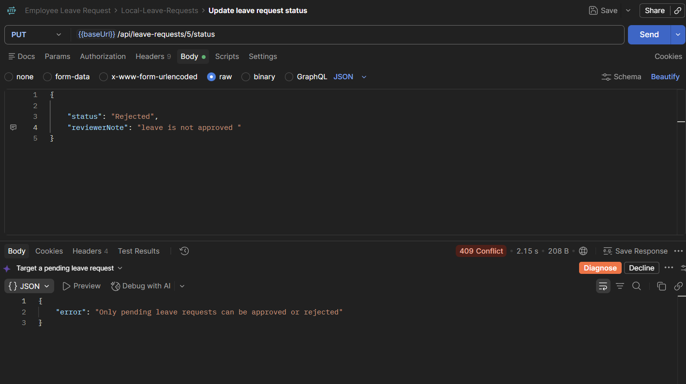
### Delete Leave Request
